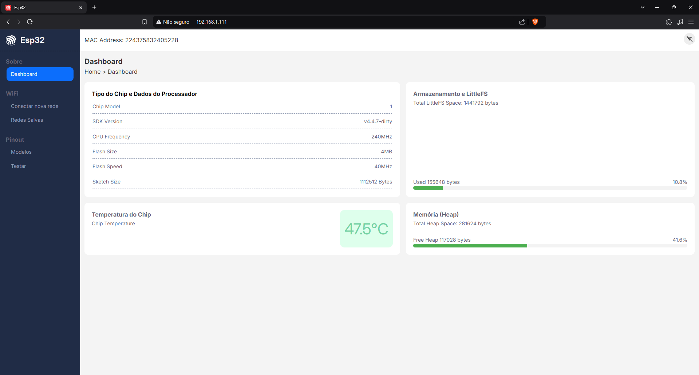

# Dashboard Admin

Sistema web para visualização das informações do **Esp32**, através de um Dashboard.



## Servindo a Página Web

O **ESP32** utiliza o sistema de arquivos **SPIFFS** para armazenar os arquivos estáticos (`index.html`, `CSS`, `JavaScript`). Antes de rodar o projeto, carregue os arquivos no **ESP32**.

1. Suba os arquivos estáticos para o SPIFFS:

```bash
pio run --target uploadfs
```

2. Compile e suba o firmware para o **ESP32**:

```bash
pio run --target upload
```

3. Abra o monitor serial para ver os logs:

```bash
pio device monitor
```

4. Acesse a página HTML pelo IP do **ESP32** (`http://<IP_DO_ESP32>`).

## Implementar

- [x] Servir pagina principal com dados estáticos

- [ ] Exibir informações do dispositivo em tempo real
    - `EspInfo`
    - FreeRTOS

- [ ] Implementar Access Point para servir a aplicação

- [ ] Implementar form para se conectar ao wifi
    - Preferences para salvar ssid e senha 

- [ ] Implementar página para gerenciar redes salvas
    - Editar
    - Excluir

- [ ] Implementar página interativa para testes de entraida e saída dos pinos do dispositivo
    - on/off para ativar saída nos pinos de acordo com o modelo
    - testar entrada com push-button 🤷‍♂️

- [ ] Exibir modelos de esp e pinagem